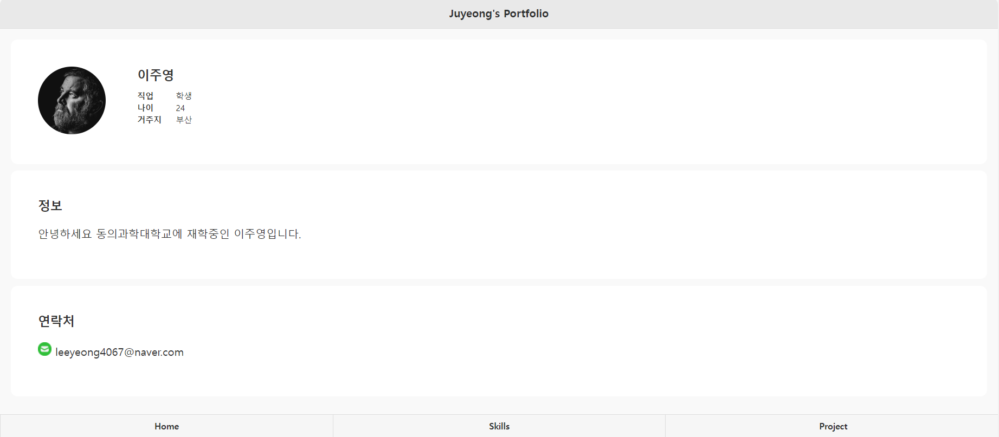
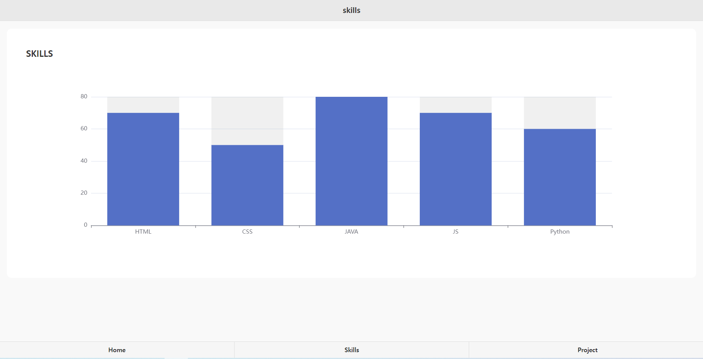
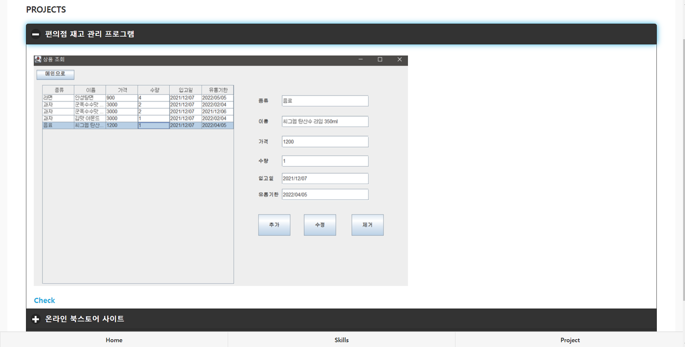

## 프로젝트 소개

[사이트 바로가기](https://leeyeong4067.github.io/Mportfolio/)<br>

<p align="justify">
  <br>
  <br>
  

  + **Skill** 해당 언어의 능력을 EChart를 통해 표현했습니다 .<br>

  

  + **Project** 지금 까지 작업한 프로젝트 내용들을 볼수 있습니다.<br>
</p>

<br>

## jquery mobile css 사용
```html
<div data-role="page">
    <div data-role="panel">
    </div>
    <div data-role="header">
    </div>
    <div data-role="content">
    </div>
    <div data-role="footer">
    </div>
</div>
```
모든 부분에 jquery mobile 사용

<br>

## 사용 언어

|   HTML  |   CSS   |   jQuery   |  JavaScript  |
| :-----: | :-----: |  :------:  | :----------: |
